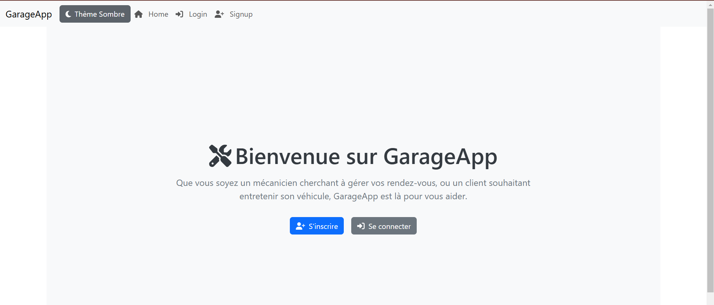
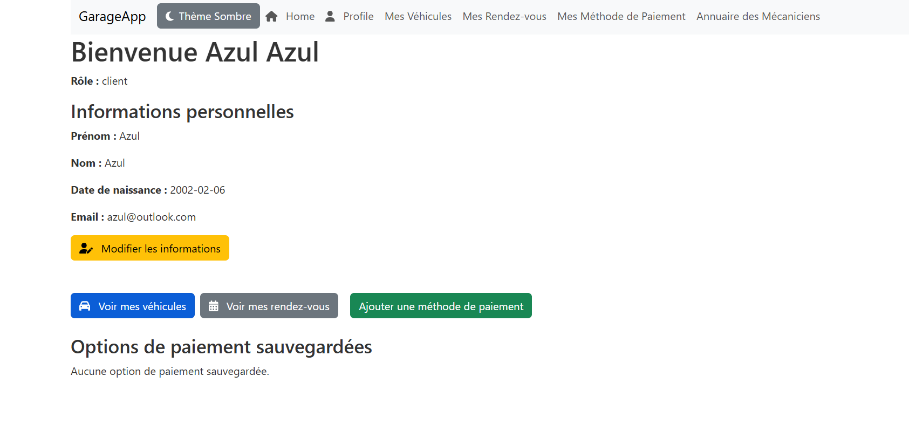
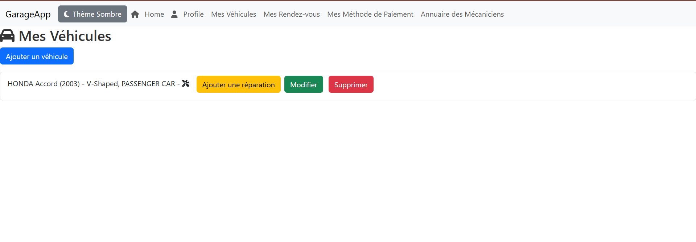
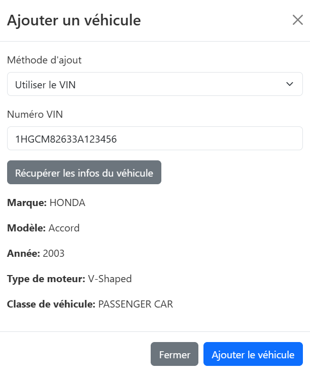
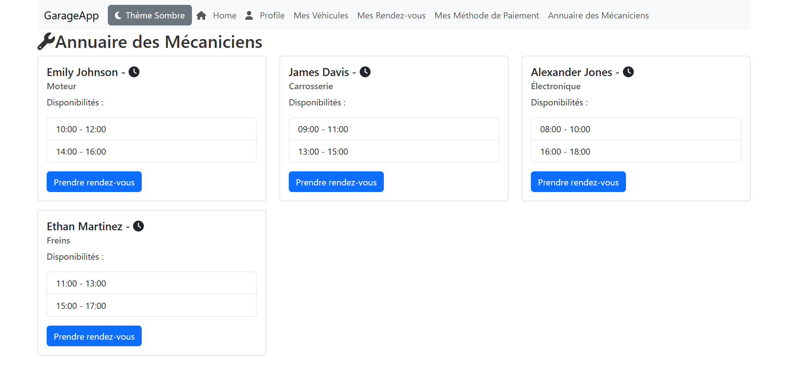
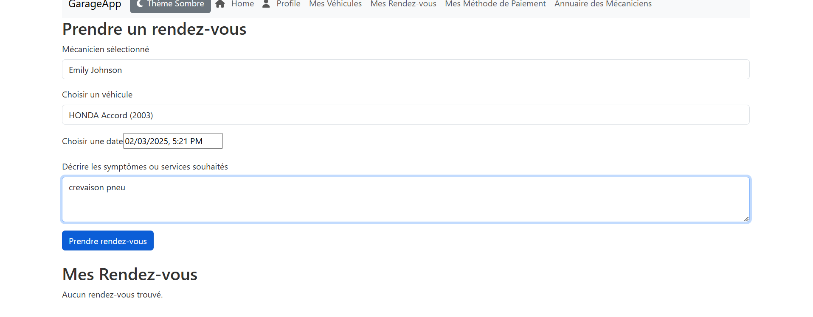
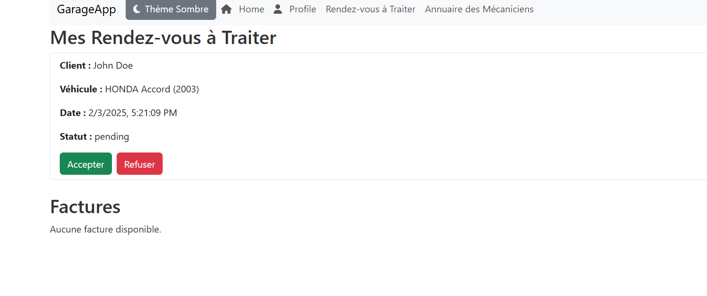
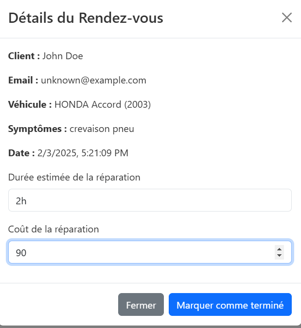

# 🛠️ Gestion de Rendez-vous pour Mécaniciens

## 📌 Description

Cette application web développée en **React** permet aux **clients** de prendre des **rendez-vous avec des mécaniciens** et de suivre l'état de leurs demandes.  

👥 **Gestion des utilisateurs** :  
- **Les mécaniciens** sont prit parmi les profils de **DummyJSON** (par defaut ils sont des mecaniciens).  
- **Les clients s'inscrivent eux-mêmes** et leurs informations sont stockées en **LocalStorage**.  

🚗 **Gestion des véhicules et rendez-vous** :  
- Ajout d'un **véhicule** avec 3 modes le principale est via un **VIN** .  
- Sélection d'un **mécanicien** et choix de l’horaire.  
- Suivi de l’état du **rendez-vous et de la facturation**.  

📦 **Stockage des données** :  
- **Pas de backend** : toutes les données des clients et rendez-vous sont **gérées via LocalStorage**.  

---

## ✨ **Fonctionnalités**
✔️ **Côté client :**  
- Inscription et stockage en **LocalStorage**  
- Ajout d’un **véhicule** avec un **VIN**  
- Sélection d’un **mécanicien (DummyJSON)** et choix de l’horaire  
- Suivi de l’état du **rendez-vous et de la facturation**  

✔️ **Côté mécanicien :**  
- Gestion des **rendez-vous reçus**  
- Acceptation/refus avec **proposition de prix**  
- Mise à jour de l’état des rendez-vous et calcul des bénéfices  

✔️ **Autres fonctionnalités :**  
- **CRUD** pour les clients, véhicules et rendez-vous (gérés en LocalStorage)  
- **Design responsive et intuitif**  

---

## 📸 Captures d’écran

### **🏠 Page d’accueil**

### **👥 Client**

### **👥 Ajout de vehicules**

### **👥 Liste des mécaniciens (DummyJSON)**

### **📅 Prise de rendez-vous**

### **📅 Rendez-vous a traiter**

### **📜 Facturation et statut**

### **📜 Etat du rendez-vous**

